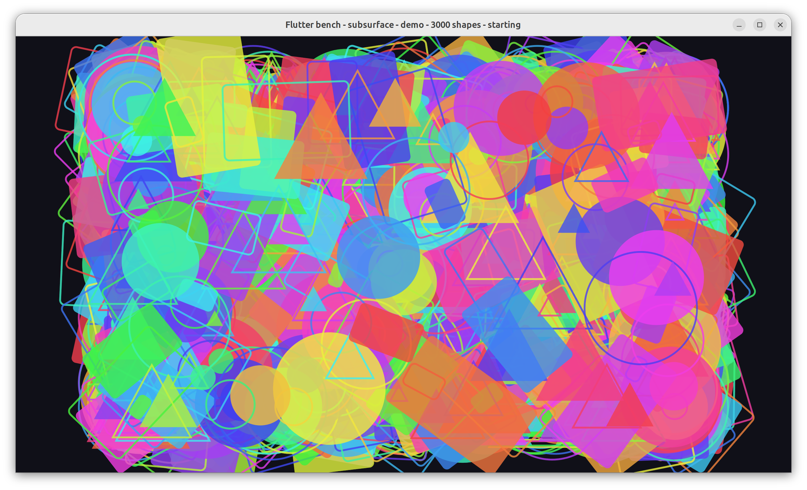
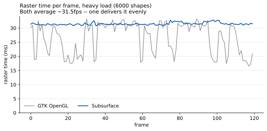
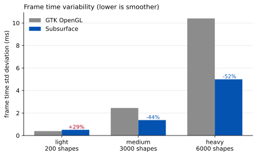
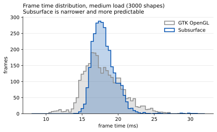
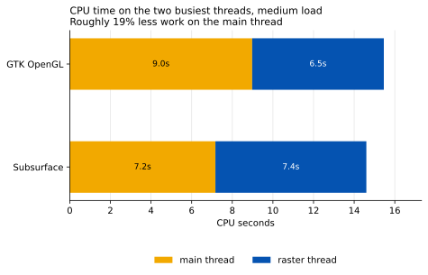

# Flutter Linux subsurface renderer benchmark

Does Flutter's new Wayland **subsurface** renderer
([flutter/flutter#191389](https://github.com/flutter/flutter/pull/191389))
perform better than the **GTK OpenGL** renderer it replaces?

**Short answer: the frame rate is the same, but frames arrive far more evenly,
and the GTK main thread does about 20% less work.**

## The workload

A Flutter app animating thousands of translucent shapes, sized to push the
raster thread.

## Frames arrive evenly instead of in lurches

Raster time for 120 consecutive frames under heavy load. Both renderers average
~31.5fps — but only one is consistent about it.

## Variability drops sharply under load

Standard deviation of frame time, so lower is smoother.

Under light load subsurface is slightly *more* variable, but at a scale
(~0.5ms) that is invisible against a 16.7ms frame budget. The improvement
appears once the pipeline is actually under pressure.

## Work moves off the main thread

Whole-process CPU barely moves (19.7s to 19.0s, −3%), but it is distributed
better: the GTK path blits to screen on the main thread, while the
subsurface path keeps presentation on the raster thread.

That matters because the main thread handles input and window management, so
work removed from it directly benefits responsiveness.

## Everything else

| | GTK OpenGL | Subsurface | |
|---|---|---|---|
| Frame rate (light / medium / heavy) | 60.0 / 58.0 / 31.4 fps | 60.0 / 59.9 / 31.5 fps | ~unchanged |
| Frame time std dev (medium) | 2.4ms | 1.4ms | **−44%** |
| Frame time std dev (heavy) | 10.4ms | 5.0ms | **−52%** |
| Raster std dev (heavy) | 5.3ms | 0.4ms | **−93%** |
| Main thread CPU | 9.0s | 7.2s | **−20%** |
| Total process CPU | 19.7s | 19.0s | −3% |
| First frame | 199ms | 205ms | ~unchanged |

Measured on an AMD Radeon 860M with Mesa 26.0.8, under Mutter at 2560x1440
(DPR 2), using an optimized profile engine build. Five repetitions per
renderer per load level, alternating order.

## Interpreting the raster numbers

Raster times look *worse* for subsurface in the raw percentile tables. That is
relocated work, not extra work — the GTK path composites on the raster thread
and blits on the main thread, while subsurface does both on the raster thread.
`FrameTiming`'s per-thread metrics stop being comparable when an architecture
moves work between threads, which is why this repo measures per-thread and
whole-process CPU too.

## More

- **[REPORT.md](REPORT.md)** — full analysis, every metric, caveats
- **[BENCHMARKING.md](BENCHMARKING.md)** — how to run it yourself
- `results/`, `startup/`, `thread_cpu/` — raw data, including per-frame samples

Results from other GPUs, drivers and compositors are welcome — the jitter
improvement comes from GPU contention between threads, which will vary by
system.

## Licence

BSD-3-Clause, matching flutter/flutter. The app directories originate from
`flutter create` templates.
